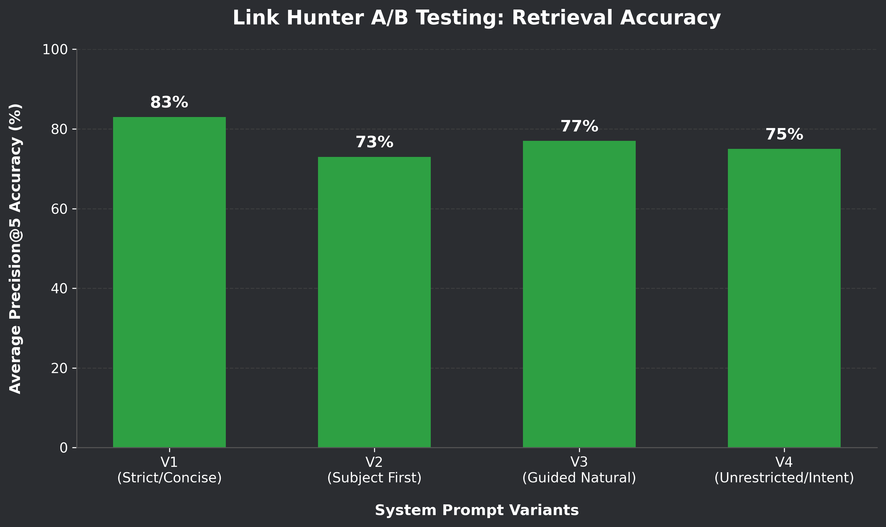

# Link Hunter 🎯

**Link Hunter** is an AI-powered Chrome Extension designed for makers, crafters, and DIY enthusiasts. It allows users to right-click any craft, hobby, or handmade item image on the web and instantly discover the best YouTube tutorials on how to make it. 

Instead of guessing keywords, Link Hunter uses a Vision-Language Model to analyze the image, figure out the exact materials and techniques required, and serves up the highest-quality, most relevant video guides directly in your browser.

## 🛠️ How to Install and Use

To use Link Hunter on your own machine, follow these simple steps:

1. **[Download the extension.zip file here](https://github.com/CODEsane04/Link-Hunter/raw/main/extension.zip)** and unzip it.
2. **Open Chrome** and navigate to `chrome://extensions` in your address bar.
3. **Enable "Developer mode"** (toggle in the top right corner).
4. Click **"Load unpacked"** in the top left menu.
5. **Select the unzipped folder** from step 1.

You're all set! Right-click any DIY image on the web and select "Search with LH" to see the magic happen.

## 🧠 Technical Architecture & Features

Link Hunter operates on a streamlined, AI-first pipeline, bridging a lightweight browser extension with a high-performance, asynchronous FastAPI backend to deliver hyper-relevant YouTube tutorials.

* **Unified Asynchronous Backend:** The architecture has been migrated to a pure Python environment powered by FastAPI. This eliminates the overhead of polyglot child-process spawning, providing a unified, low-latency API capable of executing heavy machine learning workflows and handling concurrent web requests natively.
  
* **Two-Stage Vision-Language Pipeline:** Image analysis is driven by Google's **Gemma-4-31b-it** model orchestrated via LangChain. To bypass strict anti-bot and hotlinking protections (e.g., on Pinterest), the backend dynamically fetches and Base64-encodes target images before transmitting them to the LLM.
  * *Stage 1 (Visual Routing & Extraction):* Analyzes the image to immediately reject noise (mass-produced commercial items, landscapes) and extract critical DIY metadata (core subject, crafting technique, primary materials).
  * *Stage 2 (Intent-Driven Query Generation):* Synthesizes the extracted metadata to formulate a highly specific, human-like search string that precisely answers the semantic intent of the user.
    
* **Bulletproof Structured Extraction:** The AI pipeline enforces strict Pydantic schemas to guarantee predictable JSON outputs. To ensure zero downtime from LLM hallucinations or conversational "chatter," the system features a custom, multi-layered regex fallback parser that surgically extracts nested JSON arrays and objects, ensuring the pipeline never crashes during data transfer.
  
* **Semantic Re-Ranking Engine:** To solve YouTube's issue of broad or irrelevant keyword matching, Link Hunter implements a custom NLP re-ranking step. It generates vector embeddings of the retrieved video titles using a SentenceTransformer (`all-MiniLM-L6-v2`) and calculates the Cosine Similarity against the generated search query. Videos falling below the strict semantic threshold are instantly purged from the results.
  
* **Algorithmic Freshness Decay:** Because standard YouTube search heavily favors older videos with accumulated lifetime views, Link Hunter applies a custom mathematical decay function (`Score = Views / 1.2^Years`) that penalizes outdated content, ensuring the final filtered results offer an optimal balance of high historical popularity and modern relevance.

## Features & Specifications

* **Prompt Engineering & A/B Testing:** The query generation pipeline was rigorously optimized through structured A/B testing across 4 distinct system prompt variants. Evaluated on a curated subset of our golden dataset, **Prompt V1 (Strict/Concise)** initially led the pack, achieving an **83% Average Retrieval Accuracy** alongside a flawless **100% Routing Accuracy** (correctly distinguishing DIY vs. non-DIY images). **Prompt V3 (Guided Natural)** followed closely with 77% average retrieval accuracy and 100% routing accuracy.
  

  
  

* **LLM-as-a-Judge Evaluation Framework:** To ensure production-ready reliability, the pipeline was benchmarked against the complete golden dataset using an automated "LLM-as-a-Judge" architecture. This judge model autonomously graded retrieval quality by strictly matching the top retrieved YouTube video titles against expected rubric descriptions (Precision@5). In this comprehensive full-scale evaluation, **System Prompt V3** demonstrated superior generalization and human-like query formulation, ultimately standing out with a sustained **83% Overall Accuracy**.

